# Text Brush

<p>
  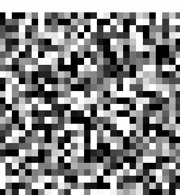
  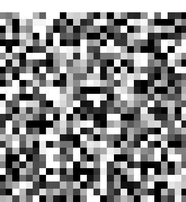
  <br>
  <em>DDPM (left) and DDIM (right)</em>
</p>

A project that implements generative machine learning models for text and images. The purpose is to implement important
and impact-full machine learning architectures and algorithms like Transformers, large language model (LLM),
generative pre-trained transformer (GPT), vision transformer (ViT), diffusion and contrastive learning. The focus is on
the core principles, therefore simple and easily trainable datasets like handwritten digits (Mnist) and tiny
Shakespeare are used. Note however that the implementations are not just simplifications and hacks, it should be
possible to just scale everything (like model size, datasets and compute) to get really good performance on more
complex data. This project is partly inspired by the work of Andrej Karpathy.

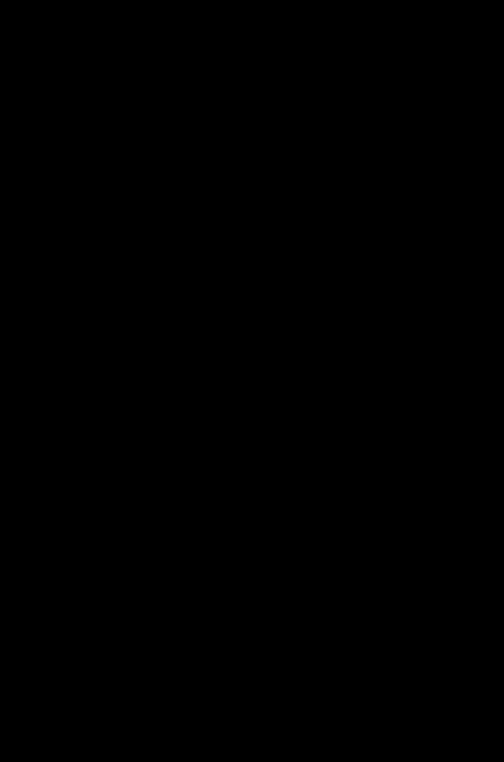

## Usage

This chapter contains example commands.

```
python main.py --help
```

### Train the Model

To train the model (neural network) of the application run:
```
python main.py --train <application>
```

To monitor the GPU during training run:
```
watch -n 1 nvidia-smi
```

### Generate Text

To generate text (1000 characters with prompt "QUEEN") run:
```
python main.py text -p "QUEEN" -n 1000
```

### Generate Images

To generate images (digit 5) run:
```
python main.py image -d 5
```

### Classify Images

To classify (10) images run:
```
python main.py image -n 10
```

### Visualize the Model

To visualize the model (neural network) of the application run:
```
python main.py --visualize-model <application>
```

### Run Static Code Analyzers

To check all linters run:
```
make lint
```

## Datasets

The datasets used are Tiny Shakespeare and MNIST.

## Attention

Attention is a mechanism where the input data decides where to focus, i.e. which parts to give the most weight to. This
can be seen as weights of the neural network that are not learned but instead extracted from the current input data. A
small neural network is often used to convert the input data to these weights. This small network could in the simplest
cases just be a linear layer. Note that the weights in this small conversion network are learned during the training
process. The full/larger network also often contain other modules than attention that has learnable weights. An
example of an attention module is the Squeeze and Excitation used in CNN networks: https://arxiv.org/abs/1709.01507

## Transformer

The Transformer is a neural network architecture that transforms a set of vectors to another set of vectors. It is a
very general architecture that has been applied to a multitude of applications and modalities. The Transformer
typically consists of a positional encoder followed by a series of blocks, where each block contains an attention block
and a feed-forward block, with normalization and residual connections. The input is a set of vectors of shape
`(B, T, C)`, where `B` is batch size, `T` is number of vectors (also known as tokens) and `C` is the dimension (length)
of each vector. The output shape is identical to the input shape. This shape stays fairly consistent during the entire
Transformer, with only temporal changes to other shapes.

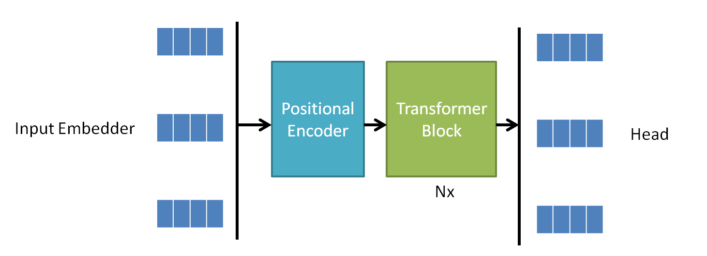

This blog post contains a good and easy to grasp explanation of the Transformer:
https://peterbloem.nl/blog/transformers.

### Input Embedder

The Transformer operates on a set of vectors known as tokens, with a certain dimension. The input must thus be
converted to this format and how this is done differs depending on input type. Text is typically tokenized and then
a simple look-up table is used to get the token encoding. For images a common approach is to divide the image into
patches, flatten each patch and run each thorough a linear layer.

### Positional Encoder

A Transformer is permutation-invariant, meaning that if the input is rearranged the output will be identical but also
rearranged. In most applications the position of the input contain meaningful information, e.g. position of a word in a
sentence or a patch in an image. To add this information, positional encodings are added to the input vectors. These
could be static fixed (like sine and cosine functions at different frequencies) or learnable. Fixed and learnable
typically gives similar performance in many applications. The shape of these vectors are `(T, C)` to match the input.

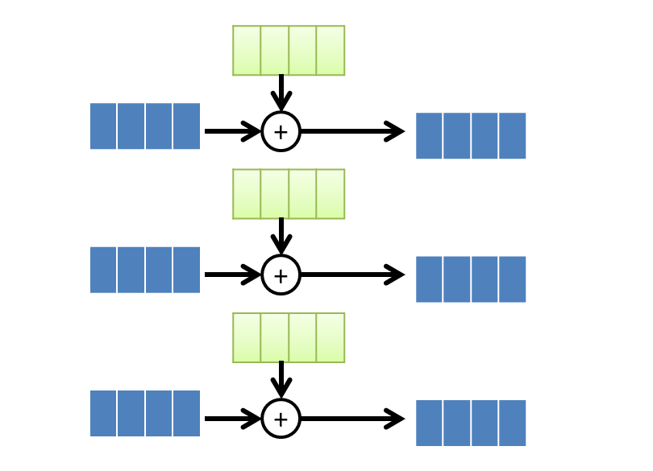

### Transformer Block

The Transformer block consist of an attention block and a feed-forward block, typically an MLP. Each of these sub blocks
starts with a layer normalization and is wrapped with a residual connection. The input and output has shape `(B, T, C)`.

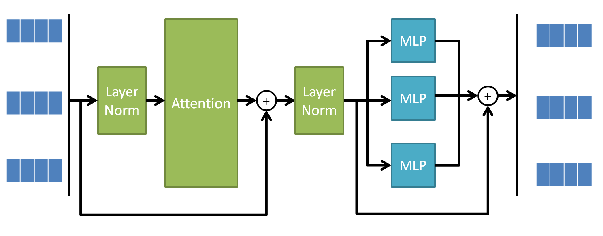

#### Scaled Dot-product Attention

This is the core of the Transformer architecture. The attention used in Transformers is calculated as

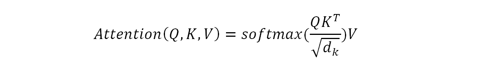

where `Q`, `K` and `V` are linear transformations of the input vectors, `dk` is the embedded dimension (`C`). By
calculating the dot-product of `Q` with `K` we get a similarity measure, the product will be large if the vectors are
similar. This value is then divided by the square root of the dimensions of the vectors. This will improve the training
by avoiding the flat region of the softmax causing small gradients. Using exactly this normalization keeps the variance
constant. Finally a softmax is applied to keep the result between zero and one. This operations produces the attention
matrix of size `(T, T)`, telling how much a certain token should attend to all other tokens. This matrix is then
multiplied by `V`.

Each output vector `Y` is thus a weighted average of `V`.
```
Y0 = W00 * V0 + W01 * V1 + W02 * V2  # Vector
Y1 = W10 * V0 + W11 * V1 + W12 * V2  # Vector
Y2 = W20 * V0 + W21 * V1 + W22 * V2  # Vector
```
The weights comes from a dot product between `Q` and `K`. Similar vector thus gets a larger weight, the output vector
is putting lots of attention to similar vectors.
```
W00 = Q0 ⋅ K0  # Scalar
W01 = Q0 ⋅ K1  # Scalar
W02 = Q0 ⋅ K2  # Scalar
W10 = Q1 ⋅ K0  # Scalar
.
.
.
```
The weights form the attention matrix:
```
W00 W01 W02
W10 W11 W12
W20 W21 W22
```

The Transformer attention is basically a "soft" dictionary. For a particular output
`Yi` its query `Qi` is compared against all keys `K` to decide how similar they are. The higher the similarity the more
influence that corresponding `V` will have on the output `Yi`. This allows each output to access global information and
focus/attend on the parts that are relevant for this particular output.

Another way to look at attention is that you have a directed graph where the vectors are the nodes and the attention
matrix is the edges, i.e. describes how the nodes are connected and how strong the connection is. In standard attention
all nodes are connected to eachother. If some nodes should not be connected this is specified by setting the
corresponding edge to 0 in the attention matrix. Text generation typically use a triangular mask to make sure tokens
cannot look into the future. There are also optimizations that could remove some connections and thereby reduce the
size of the attention matrix. The size of the attention matrix is typically the compute bottleneck of the Transformer
as it will grow quadratically with the number of tokens.

##### Multi-Head Attention

Multi-head attention is basically the same as the attention described above but with multiple `Q`, `K` and `V`
calculated from different linear matrices. The attention is then computed in parallel for these. This results in one
set of output vector per head that are concatenated at the end with a final linear transformation. The dimension `C`
is typically reduced to `Ch = C/#heads` by the initial linear transforms and then converted back to `C` by the final
concatenation and linear layer. This is what is used as attention block in the Transformer.

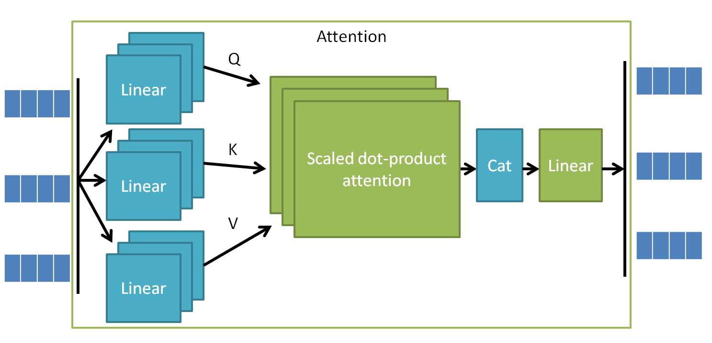

##### Cross-attention

The attention described so far is called self-attention. Cross-attention is basically the same thing, the difference
is that the `K` and `V` vectors come from a different set of vectors than the `Q` vectors. Cross-attention is often
alternated with self-attention. One example could be lidar/camera sensor fusion where self-attention is applied to the
lidar features followed by cross-attention between the lidar and camera features.

#### Feed Forward (MLP)

The feed-forward network typically is a small MLP with two linear layers with a non-linearity in between. The hidden
dimension is typically about 4 times larger than the input and output dimensions. The MLP is applied to each token
individually but the weights are shared, i.e. the same network is applied to all tokens.

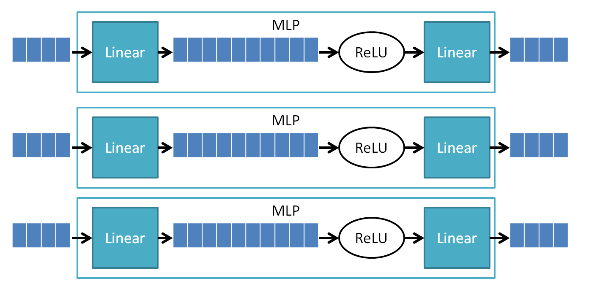

#### Normalization

The Transformer applies layer normalization in three locations; before the attention block, before the MLP block and at
the output from the last Transformer block, this is known as pre-LN. The initial transformer did instead use post-LN.
The main purpose of the normalization is to make the training more stable and converge faster. Layer normalization
normalizes the last dimension, i.e. channel dimension to have zero mean and unit standard deviation. It also contain
two trainable parameters to scale and shift the output to not necessarily have zero mean and unit standard deviation.

#### Residual Connection

The attention block and feed forward block each have a residual connection. The purpose of this is to enable deeper
architectures as the gradient can take a shortcut all the way from output to input. This makes training easier as at
initialization each branch can contribute with only a small addition and then increase as the training goes on.

### Head

The final transformation of the output tokens depends on the application. A language model typically uses linear layer
to convert from the embedding dimension to the size of the vocabulary to get logits, then applies softmax to get the
probabilities for each next word. Typically only one of the tokens is used in the head, in language models only the
last token is used and in classifiers only the CLS token (typically first) is used.

## U-net

The U-net architecture consist of an encoder, a bottleneck and a decoder. It has long skip connections between
corresponding blocks in the encoder and decoder, the last decoder block is connected to the first encoder block,
the second last to the second, etc. The encoder typically reduces spacial resolution and increases the number of
channels while the decoder does the reverses of this. The integration of decoder and encoder `C` varies between
architectures, but common approaches are concatenation or addition. The bottleneck process the most condensed data.
This is a useful architecture for applications that process images and the input dimension should match the output
dimension, e.g. semantic image segmentation.

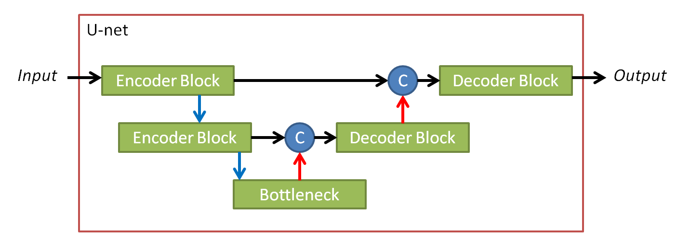

### Transformer U-net

The transformer U-net uses transformer blocks for all parts (encoder, bottleneck and decoder). It differs from the
typically U-net by keeping the dimensions, i.e.  spatial dimension is not decreased and channels are not increased.
The concatenation `C` is a cat layer (on embedded dimension) followed by a linear layer to keep the embedded dimension
constant.

## Diffusion

Diffusion is a process used to sample from a distribution `p(x)` in a clever way. `x` could for example be all images
or just a subset of this, like handwritten digits. Sampling directly from `p(x)` is often hard/impossible (if you want
new unseen samples) even for a deep neural network. To tackle this problem diffusion defines a process to convert
`p(x)` to a known distribution like the standard normal distribution `N(0, I)` (i.e. pure noise). To sample from this
distribution is trivial. Then what we also need is a reverse process that can convert a sample from `N(0, I)` back to
`p(x)`.

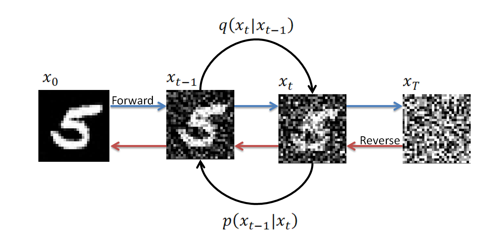

Diffusion is quite a generic concept that could be applied to other areas than image generation. Note that the math
behind diffusion is quite involved, this chapter only gives a high level overview and intuition. Mostly parts that are
needed to implement diffusion is covered here.

### Forward Diffusion

The goal of the forward diffusion is to go from `p(x)` to `N(0, I)`. This is done by an iterative process of `T` time
steps `(1, 2, ..., T)`, that is started by sampling `x_0` from `p(x)`, i.e. pick a random already existing image. In
each time step we scale down the image and add a little bit of Gaussian noise:

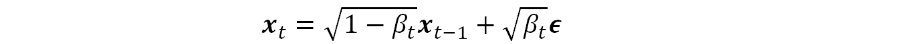

where `B` is the variance (controls the strength of the noise) and the noise `e` is sampled from `N(0, I)`.

Adding noise like this is equivalent to sample `x_t` from a conditional normal distribution with mean `sqrt(1-B)*x_t-1`
and variance `B`:

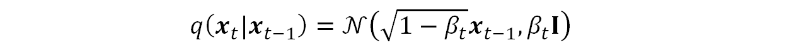

By selecting the mean and variance this way we make sure to end up at `N(0, 1)` as `T` goes to infinity.

Note that due to the properties of the Gaussian we can go directly to any time step `x_t` from `x_0` by

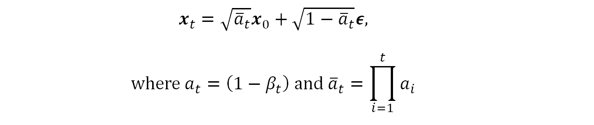

This is very important for efficient training.

### Reverse Diffusion

The goal of the forward diffusion is to go from `N(0, I)` to `p(x)`. This is done by an iterative process of `T` time
steps `(T, T-1, ..., 1)`, that is started by sampling `x_T` from `N(0, I)`, i.e. create an image containing only noise.
In each step we remove a little bit of noise. Removing noise is however a much harder problem than adding noise. The
reverse process is defined as:

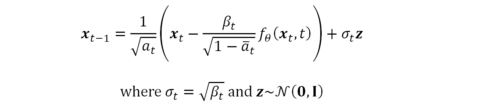

`f` is a noise predictor, typically implemented as a neural network, that predicts the noise to remove from `x_t` to
get `x_0`, given a time step `t`.

This is equivalent to sample `x_t-1` from a conditional normal distribution:

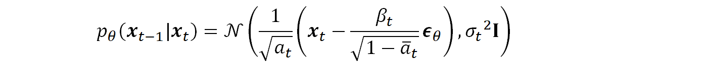

By selecting the mean and variance in this way we make sure we reverse the forward process and end up at `p(x)`. Note
however that for it to truly be the exact reverse the variance should not be exactly `B`, using `B` do however work
well in practice.

The intuition behind this is that by predicting the total noise added we get a stable "direction" towards the final
image, compared to the direction we would get from just predicting the noise added by the previous step. We then take
just small step in this direction and randomly move in another direction by adding noise. The reason for adding noise
is to provide variety, if this is skipped we would end up in the center/average of the training images, resulting in
low variety blurry images. Note that there are alternatives to this reverse process, DDIM for example gives good result
even without adding any noise.

### Noise Schedule

The variance `B` is typically not constant, it varies for each time step. A common schedule is linear e.g. `10e-4` to
`0.02` and a common amount of time steps `T` is `1000`.

### Conditioning

To control the reverse process to e.g. create a sample from a certain class, one can provide a condition `c` to the
nose predictor function `f`:

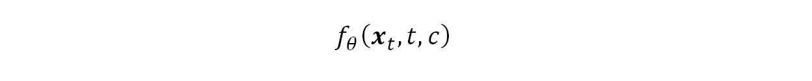

This would result in a distribution conditioned on `c`:

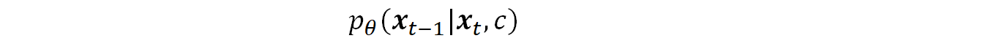

To make the process adhere to the condition even more a concept called classifier-free guidance can be used. The idea
is to run `f` twice, once on with the condition `c` and once without. Then use the difference of these. In this way we
can amplify the direction towards the condition/class, by a weighting factor `w`:

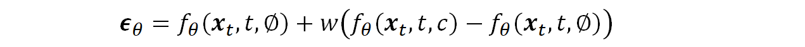

Classifier-free guidance is crucial for good performance on complex data.

### Training

To train the neural network used in the reverse process, `f` forward diffusion is used with the following algorithm:

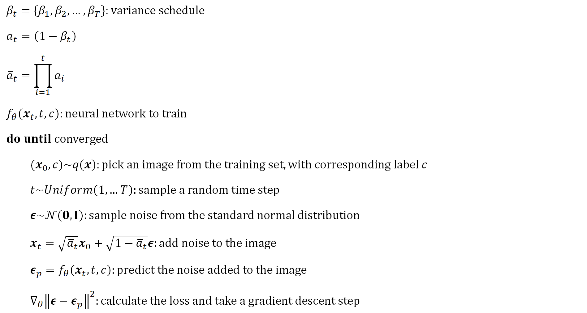

Note that the images shall be normalized to [-1,1]. For large images an autoencoder can be used to first convert the
image to a smaller latent space via the encoder, do diffusion in this space, and finally use the decoder to transform
it back to image space. This one of the key ideas in Stable Diffusion. Make sure to watch out for overfitting,
diffusion models typically have a sweet spot where they perform well and if trained beyond this performance is
decreased.

### Sample

To sample, i.e. generate an image, reverse diffusion is used with the following algorithm:

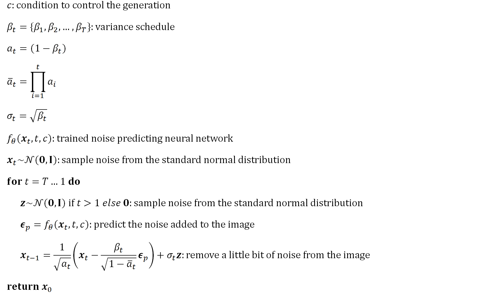

## Applications

This chapter describes the applications.

### Text Generator

This application uses a GPT model to generate text. It uses a very simple character level tokenizer and an embedding
table to produce the input tokens (note that in more serious work tokenization is an extremely important part).

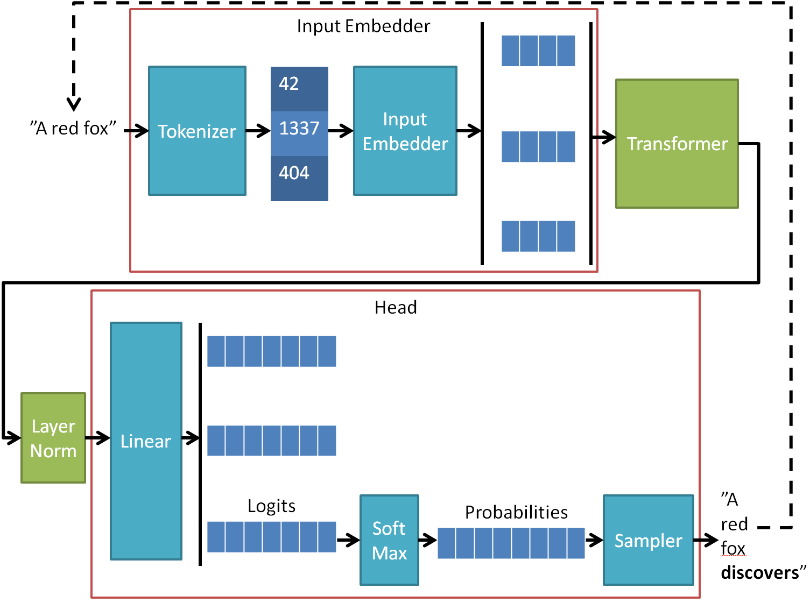

A mask is used in the Transformer to avoid cheating by looking ahead. The goal is to predict the next character. To
do this the head applies a linear layer to convert the output tokens from the embedding dimension to the vocabulary
size logits with a final softmax to get probabilities. During training all tokens are used in the loss calculation
for efficiency, during inference only the last token is used. The next character is sampled from the distribution
received from the last token, using a top-K approach to not derail too much.

```
>>> python main.py text -p "QUEEN" -n 500

QUEEN ELIZABETH:
But is this fellow milrds from any stars.

ANGELO:
I am here true?

ANGELO:
O, best so: thy brother, and thou canst dost thou seized
As thou art one penice to company a deer,
A charge will be part. That if thou back'd to thine own
If but to the frather bragght-beauty in burness' stail.

LEONTES:
O beggar; forth thou art.

LEONTES:
Or if any twice the most ordering:
And thou must deserves thee her and day?

CLARENCE:
Why, hath mine else world me to speeds to the princh'd;
Bounds he is
```

### Image Generator

This application generates images from noise using a diffusion process with the U-net vision Transformer (U-ViT) as
noise predictor.

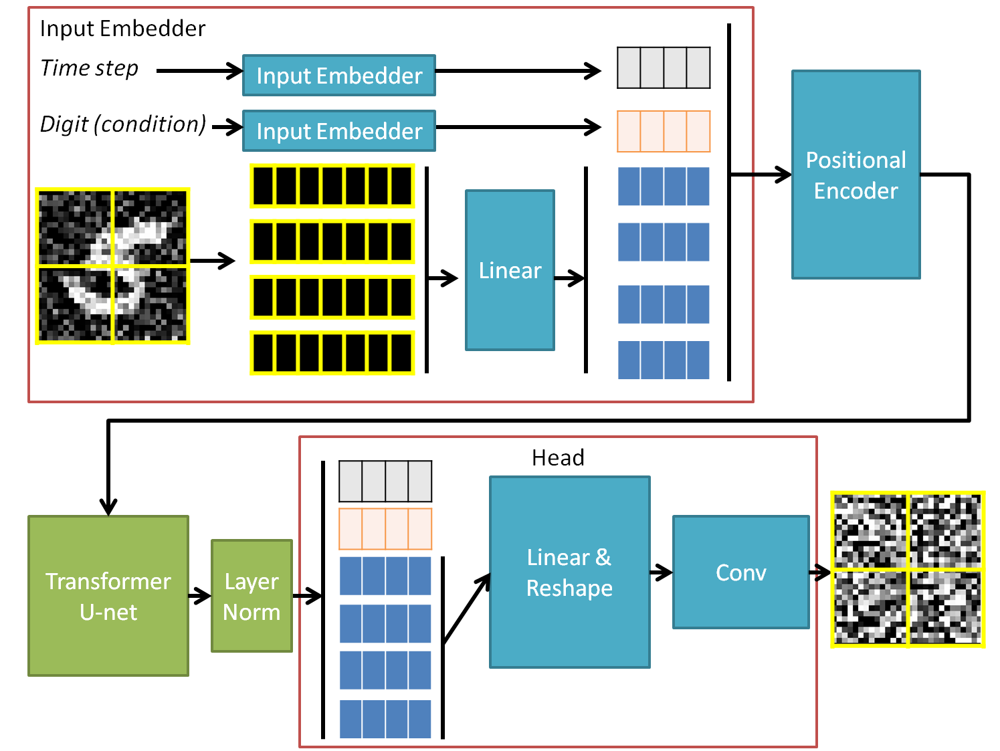

The image is dived into patches which are then flattened and a linear layer is used to convert the dimension to the
embedding dimension. Each patch is then treated as a token. In addition to the image a time step `t` and condition `c`
(in this case a digit) is embedded to produce tokens. All these tokens are then positional encoded and passed through
a Transformer U-net. The tokens corresponding to the image are then converted back to form an image again. This is
done by a linear layer to convert the embedding dimension to `channels x patch_size x patch_size` followed by a reshape
operation. A final convolution layer is applied to produce the noise prediction.

The diffusion process starts with a noisy image and iteratively uses the noise predictor to remove noise and produce
a clear image. It uses a condition to control which digit to generate.

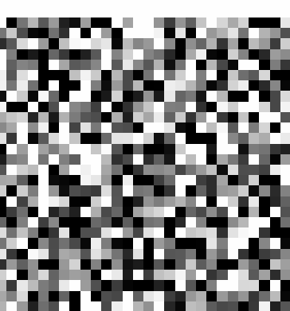

### Image Classifier

This application implements the ViT architecture.

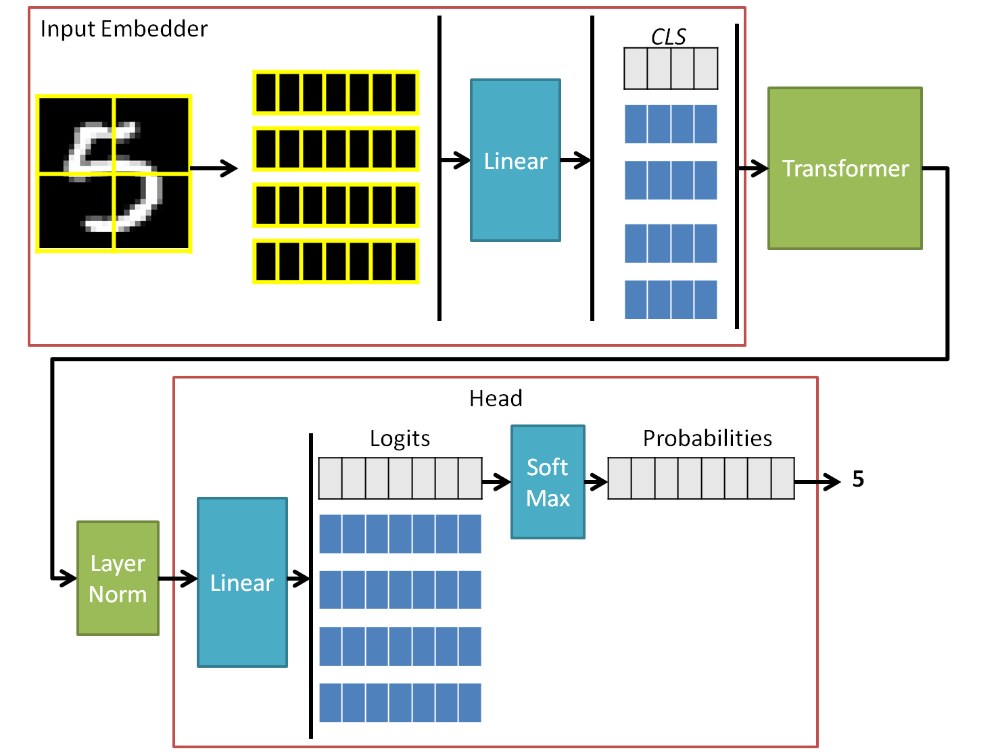

The image is dived into patches which are then flattened and a linear layer is used to convert the dimension to the
embedding dimension. Each patch is then treated as a token. To do classification a CLS token is appended to the patch
tokens and it is this token that is then used to perform the classification. A linear layer converts from the embedding
dimension to number of classes, these logits are then send through a softmax to get probabilities. The class is then
simply the highest probability class.

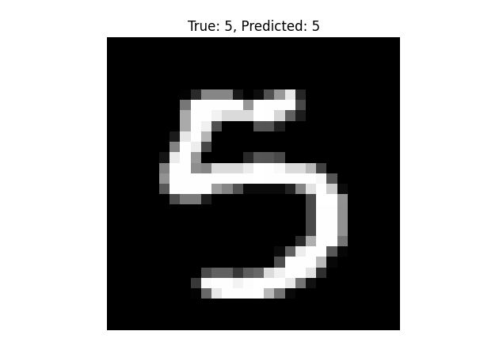

## PyTorch

This project uses the PyTorch (Python version of Torch) machine learning framework. It is a very user friendly
framework that integrates well with the core Python principles. There are however some things to think about.

### Device

All tensors involved in the computation must be on the correct device (e.g. CPU or GPU). This must be handled manually
in many cases, e.g. when creating new tensors. This also applies to the models. Note that for a model you do
`model.to(device)` while for a tensor you need to `x = x.to(device)`.

### Reshape

There are several ways to reshape tensors in Torch, with benefits and drawbacks.

| Shape       | Dimension decrease/increase | Dimension reorder | Expansion | Memory       |
| ----------- | --------------------------- | ----------------- | --------- | -------------|
| `reshape`   | `squeeze`                   | `transpose`       | `expand`  | `contiguous` |
| `view`      | `unsqueeze`                 | `permute`         | `repeat`  |
| `flatten`   |
| `unflatten` |

### Broadcast

Be careful when relying on broadcast, often manual work (e.g. adding dimensions) is required for it to work out
properly.

### Optimization

Do not forget to zero the gradients for each step in the training `optimizer.zero_grad()`. It is also important to have
the model in the correct mode, `model.train()` when doing training and `model.eval()` for almost all other use cases,
e.g. inference. Another thing to remember is to use `torch.no_grad()` when gradients are not needed, e.g. during
evaluation and inference.

Training loop functions often becomes very bloated with a huge parameter list. A neat approach is to implement the
training loop as a generator and only keeping the absolute minimum in this generator. This can then easily be extended
as needed. With this approach there are no need for callback functions, logic for storing the models, evaluation
handling, logic for early stopping, etc. All of this can be added outside as needed.

### Detach

To avoid huge memory leaks during training it is very important to detach the loss tensor from the compute graph. This
is done via `.item()` or `.detach()`. Code like this is very bad: `losses.append(loss)`.

## Relevant Papers

- Attention Is All You Need (Transformer): https://arxiv.org/abs/1706.03762
- An Image is Worth 16x16 Words: Transformers for Image Recognition at Scale (ViT): https://arxiv.org/abs/2010.11929
- Language Models are Few-Shot Learners (GPT): https://arxiv.org/abs/2005.14165
- Denoising Diffusion Probabilistic Models (DDPM): https://arxiv.org/abs/2006.11239
- Denoising Diffusion Implicit Models (DDIM): https://arxiv.org/abs/2010.02502
- Classifier-Free Diffusion Guidance: https://arxiv.org/abs/2207.12598
- All are Worth Words: A ViT Backbone for Diffusion Models (U-ViT): https://arxiv.org/abs/2209.12152
- Deep Residual Learning for Image Recognition (ResNet): https://arxiv.org/abs/1512.03385
- Gaussian Error Linear Units (GELUs): https://arxiv.org/abs/1606.08415
- Layer Normalization: https://arxiv.org/abs/1607.06450
- Dropout: A Simple Way to Prevent Neural Networks from Overfitting: https://www.cs.toronto.edu/~rsalakhu/papers/srivastava14a.pdf

## TODO

* Implement FID metric
* Add and use CIFAR-10
* Set random seed?
* Add learning rate scheduler?
* Add augmentations?
* Create data classes for settings?
* Implement CLIP
* Text generate Mnist (using CLIP)
* Text search Mnist (using CLIP)
* Flash attention
* Sparse attention
* Multi-head Latent Attention (MLA)
