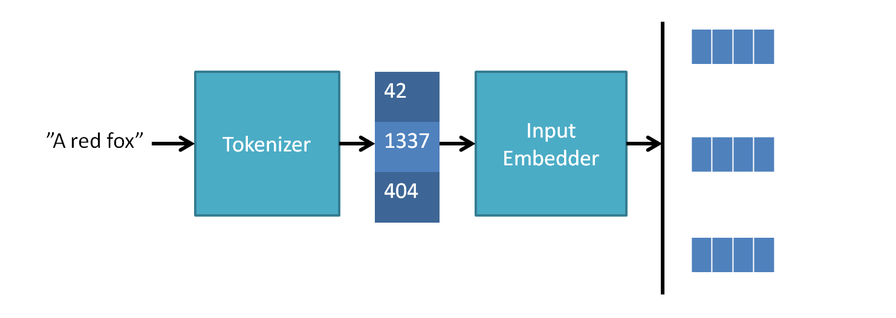
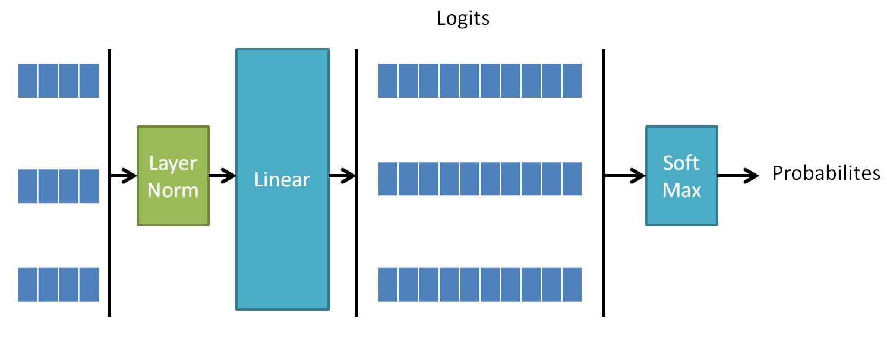

# Text Brush

A project that implements generative machine learning models for text and images. The focus is on handwritten digits
and the core architecture component is the transformer. The purpose is to implement important machine learning
architectures and algorithms like large language model (LLM), generative pre-trained transformer (GPT),
vision transformer (ViT), diffusion and contrastive learning. This project is partly inspired by the work of Andrej
Karpathy.

## Usage

This chapter contains example commands.

```
python main.py --help
```

### Train the Model

To train the model (neural network) of the application run:
```
python main.py --train <application>
```

To monitor the GPU run:
```
watch -n 1 nvidia-smi
```

### Generate Text

To generate text (1000 characters with prompt "QUEEN") run:
```
python main.py text -p "QUEEN" -n 1000
```

### Classify Images

To classify images (10 images) run:
```
python main.py image -n 10
```

### Visualize the Model

To train the model (neural network) of the application run:
```
python main.py --visualize-model <application>
```

### Run Static Code Analyzers

To check all linters run:
```
make lint
```

## Datasets

The datasets used are Tiny Shakespeare and MNIST.

## Relevant Papers

- Attention Is All You Need: https://arxiv.org/abs/1706.03762
- An Image is Worth 16x16 Words: Transformers for Image Recognition at Scale (ViT): https://arxiv.org/abs/2010.11929
- Language Models are Few-Shot Learners (GPT): https://arxiv.org/abs/2005.14165
- Deep Residual Learning for Image Recognition (ResNet): https://arxiv.org/abs/1512.03385
- Gaussian Error Linear Units (GELUs): https://arxiv.org/abs/1606.08415
- Layer Normalization: https://arxiv.org/abs/1607.06450
- Dropout: https://www.cs.toronto.edu/~rsalakhu/papers/srivastava14a.pdf

## Applications

This chapter describes the applications.

### Text Generator

This application uses a GPT model to generate text. It uses a very simple character level tokenizer and an embedding
table to produce the input tokens (note that in more serious work tokenization is an extremely important part). A mask
is used in the Transformer to avoid cheating by looking ahead. The goal is to predict the next character. To do this
the head applies a linear layer to convert the output tokens from the embedding dimension to the vocabulary size logits
with a final softmax to get probabilities. During training all tokens are used in the loss calculation for efficiency,
during inference only the last token is used. The next character is sampled from the distribution received from the
last token, using a top-K approach to not derail too much.

```
>>> python main.py text -p "QUEEN" -n 500

QUEEN ELIZABETH:
But is this fellow milrds from any stars.

ANGELO:
I am here true?

ANGELO:
O, best so: thy brother, and thou canst dost thou seized
As thou art one penice to company a deer,
A charge will be part. That if thou back'd to thine own
If but to the frather bragght-beauty in burness' stail.

LEONTES:
O beggar; forth thou art.

LEONTES:
Or if any twice the most ordering:
And thou must deserves thee her and day?

CLARENCE:
Why, hath mine else world me to speeds to the princh'd;
Bounds he is
```

### Image Classifier

This application implements the ViT architecture. The image is dived into patches which are then flattened and a linear
layer is used to convert the dimension to the embedding dimension. Each patch is then treated as a token. To do
classification a CLS token is appended to the patch tokens and it is this token that is then used to perform the
classification. A linear layer converts from the embedding dimension to number of classes, these logits are then send
through a softmax to get probabilities. The class is then simply the highest probability class.


## Attention

Attention is a mechanism where the input data decides where to focus, i.e. which parts to give the most weight to. This
can be seen as weights of the neural network that are not learned but instead extracted from the current input data. A
small neural network is often used to convert the input data to these weights. This small network could in the simplest
cases just be a linear layer. Note that the weights in this small conversion network are learned during the training
process. The full/larger network also often contain other modules than attention that has learnable weights. An
example of an attention module is the Squeeze and Excitation used in CNN networks: https://arxiv.org/abs/1709.01507

## Transformer

The Transformer is a neural network architecture that transforms a set of vectors to another set of vectors. It is a
very general architecture that has been applied to a multitude of applications and modalities. The transformer
typically consists of an attention block and a feed-forward block, with normalization and residual connections. This
blog contains a good explanation of the foundations of transformers: https://peterbloem.nl/blog/transformers. The initial
idea comes from the Attention Is All You Need paper: https://arxiv.org/abs/1706.03762


### Input Embedding

The Transformer operates on a set of vectors known as tokens, with a certain dimension. The input must thus be
converted to this format and how this is done differs depending on input type. Text is typically tokenized and then
as simple look-up table is used to get the token encoding. For images a common approach is to divide the image into
patches, flatten each patch and run each thorough a linear layer.



### Positional Encoding

A Transformer is permutation-invariant, meaning that if the input is rearranged the output will be identical but also
rearranged. In most tasks the position of the input contain meaningful information, e.g. position of a word in a
sentence or a patch in an image. To add this information, positional encodings are added to the input. These could be
static fixed encodings like sine and cosine functions at different frequencies or learnable. Fixed and learnable
gives the same performance in many applications.


### Transformer Block


#### Scaled Dot-product Attention

This is the core of the Transformer architecture. The attention used in transformers is calculated as


where `Q`, `K` and `V` are linear transformations of the input vectors. By multiplying `Q` with `K` we get a similarity
measure, the product will be large if the vectors are similar. This value is then divided by the square root of the
dimensions of the vectors. This will improve the training by avoiding the flat region of the softmax causing small
gradients. Using exactly this normalization keeps the variance constant. Finally a softmax is applied to keep the
result between zero and one. This is the attention weight which is then multiplied by `V`.

Each output vector is a weighted average of all input vectors. The weights comes from a dot product between the
current vector and all other vectors. Similar vector thus gets a larger weight. The transformer attention is basically
a "soft" dictionary. For a particular output `Vi` its query `Qi` is compared against all keys `Kn` to decide how
similar they are. The higher the similarity the more influence that `Vn` will have on the output `Vi`. This allows each
output to access global information and focus/attend on the parts that are relevant for this particular output.

The transformer attention is a bit similar to an MLP. The differences are that the "elements" are vectors instead of
scalars, the weights are decided by the data (i.e. not learned) and the output is passed through an MLP instead of an
activation function.

Another way to look at attention is that you have a directed graph where the vectors are the nodes and the attention
matrix is the edges, i.e. describes how the nodes are connected and how strong the connection is. In standard attention
all nodes are connected to eachother. If some nodes should not be connected this is specified by setting the
corresponding edge to 0 in the attention matrix. Text generation typically use a triangular mask to make sure tokens
cannot look into the future. There are also optimizations that could remove some connections and thereby reduce the
size of the attention matrix.

##### Multi-Head Attention

Multi-head attention is basically the same as the attention described above but with multiple `Q`, `K` and `V`
calculated from different linear matrices. This results in one set of output vector per head that are concatenated
at the end with a final linear transformation.


##### Cross-attention

The attention described so far is called self-attention. Cross-attention is basically the same thing, the difference
is that the `K` and `V` vectors come from a different set of vectors than the `Q` vectors. Cross-attention is often
combined with self-attention. One example could be lidar/camera sensor fusion where self-attention is applied to the
lidar features followed by cross-attention between the lidar and camera features.

#### Feed Forward (MLP)

The feed forward network typically is a small MLP with two linear layers with a non-linearity in between. The hidden
dimension is typically about 4 times larger than the input and output dimensions. The MLP is applied to each token
individually but the weights are shared, i.e. the same network is applied to all tokens.


#### Normalization

The Transformer applies layer normalization in three locations; before the attention block, before the MLP block and at
the output from the last Transformer block. This is known as pre-LN the first transformer did instead use post-LN. The
main purpose of the normalization is to make the training more stable and converge faster. Layer normalization
normalizes the last dimension, i.e. channel dimension to have zero mean and unit standard deviation. It also contain
two trainable parameters to scale and shift the output.

#### Residual Connection

The attention block and feed forward block each have a residual connection. The purpose of this is to enable deeper
architectures as the gradient can take a shortcut all the way from output to input. This makes training easier as at
initialization each branch can contribute with only a small addition and then increase as the training goes on.

### Head

The final transformation depends on the application. A language model typically uses linear layer to convert from the
embedding dimension to the size of the vocabulary to get logits, then applies softmax to get the probabilities for each
next word. Typically only one of the tokens is used in the head, in language models only the last token is used and in
classifiers only the CLS token (typically first) is used.



## PyTorch

This project uses the PyTorch (Python version of Torch) machine learning framework. It is a very user friendly
framework that integrates well with the core Python principles. There are however some things to think about.

### Device

All tensors involved in the computation must be on the correct device (e.g. CPU or GPU). This must be handled manually
in many cases, e.g. when creating new tensors. This also applies to the models. Note that for a model you do
`model.to(device)` while for a tensor you need to `x = x.to(device)`.

### Reshape

There are several ways to reshape tensors in Torch, with benefits and drawbacks.

Shape

- reshape
- view
- flatten
- unflatten

Dimension decrease/increase

- squeeze
- unsqueeze

Dimension reorder

- transpose
- permute

Expansion

- expand
- repeat

Memory

- contiguous

### Broadcast

Be careful when relying on broadcast, often manual work (e.g. adding dimensions) is required for it to work out
properly.

### Optimization

Do not forget to zero the gradients for each step in the training `optimizer.zero_grad()`. It is also important to have
the model in the correct mode, `model.train()` when doing training and `model.eval()` for almost all other use cases,
e.g. inference.

Training loop functions often becomes very bloated with a huge parameter list. A neat approach is to implement the
training loop as a generator and only keeping the absolute minimum in this generator. This can then easily be extended
as needed. With this approach there are no need for callback functions, logic for storing the models, evaluation
handling, logic for early stopping, etc. All of this can be added outside as needed.

### Detach

To avoid huge memory leaks during training it is very important to detach the loss tensor from the compute graph. This
is done via `.item()` or `.detach()`. Code like this is very bad: `losses.append(loss)`.
